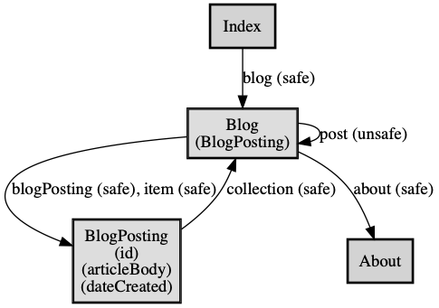

# REST Application Spec Skeleton

## Specs

 * [Profile (RFC6906)](./profile/profile.json)
 * Schema
   * [Semantic schema](./schema/semantic/)
   * [Relation schema](./schema/rel/)
   * [Fake Semantic JSON](./fake/semantic)

## Application State Diagram



[profile.png](./profile/profile.png)
 
## Scripts

### ASD

Generate an application state diagram.

```
composer asd
```
 
### Fake JSON

Generate fake JSON files based on the json schema.

```
composer fake
```

## Links

 * [RFC6906 Profile](https://tools.ietf.org/html/rfc6906)
 * [ALPS](http://alps.io/spec/)
 * [scgema.org vocabulary list](https://schema.org/docs/schema_org_rdfa.html)
 * [IANA link relations](https://www.iana.org/assignments/link-relations/link-relations.xhtml)
 * [microformats rel values](http://microformats.org/wiki/existing-rel-values)
 * [JSON Schema](https://json-schema.org/)
 * [JSON Schema Form](https://github.com/mozilla-services/react-jsonschema-form)
 
